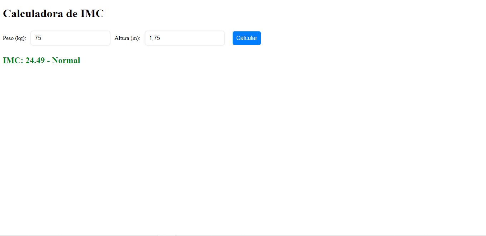
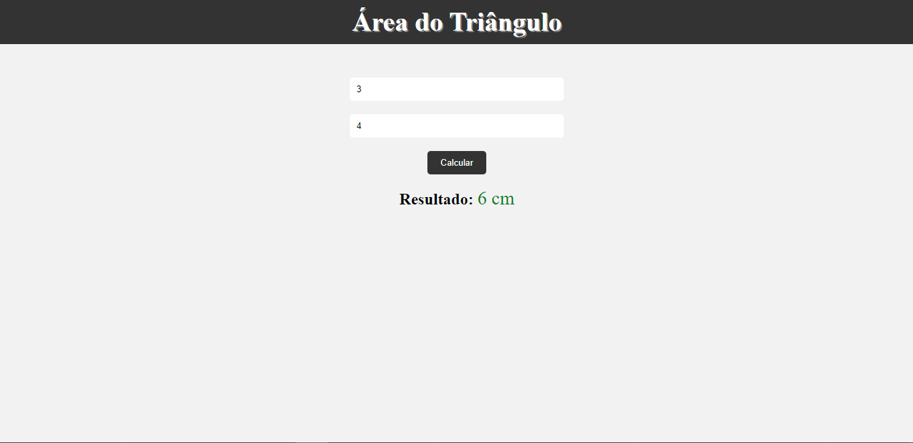

# Resolução de Ficha de Exercício JavaScript

#### Olá, o presente repositório contém resoluções de exercícios  de JavaScript.

 
## Tecnologias Usadas

# Screenshots das interfaces de alguns  exercícios

